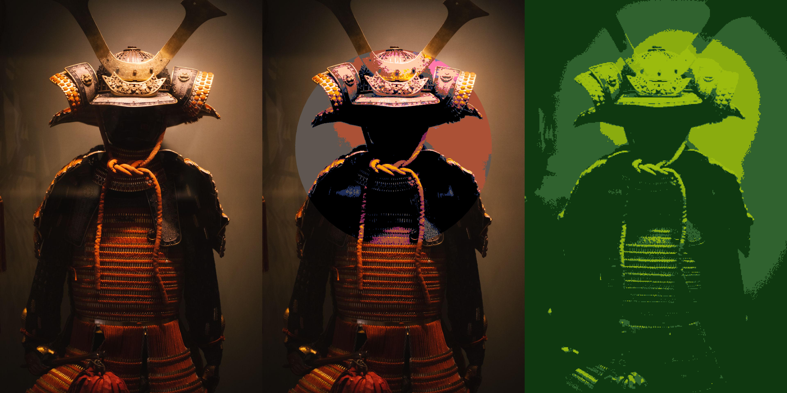

# Ditherlib

Ditherlib is a Rust library for non-destructive image effects and dithering.
Effects can target an entire image or anti-aliased polygon selections, and an
ordered pipeline can combine several selected effects into one render.

Source pixels remain immutable after loading. Each render starts from the
source and produces a separately owned image, so callers can freely edit and
re-render pipelines.



## Features

- Greyscale and Gaussian blur
- Threshold, configurable ordered, and deterministic noise dithering
- Print-style halftone screens with six dot shapes and arbitrary palettes
- Independently angled RGB and CMYK process-print screens
- Fourteen error-diffusion presets, from minimal Two-dimensional Knuth through
  broad Stevenson-Arce
- Custom diffusion kernels, strength, clamping, and scan direction
- Hilbert-curve Riemersma dithering with configurable history and decay
- Bayer, clustered-dot, line, crosshatch, checkerboard, and dispersed-dot
  threshold maps
- Built-in 16x16 blue-noise threshold map
- Custom rectangular threshold maps with strength, offset, rotation, and mirroring
- Custom RGB palettes, black-and-white palettes, and monochrome palettes
- Palette derivation from source-image colours with an optional size limit
- RGB, linear RGB, and Oklab palette matching with luminance-only control
- Rectangular logical pixels with grid offsets and five sampling modes
- Whole-image and polygon selections with anti-aliased edges
- Ordered multi-effect pipelines with reusable rendering buffers
- Crate-owned image, result, and error types

## Installation

```bash
cargo add ditherlib
```
JPEG and PNG support are enabled by default:

```toml
[dependencies]
ditherlib = "0.8"
```

Codec features can be selected individually:

```toml
[dependencies]
ditherlib = { version = "0.8", default-features = false, features = ["png", "webp"] }
```

Available codec features are `avif`, `bmp`, `dds`, `exr`, `ff`, `gif`, `hdr`,
`ico`, `jpeg`, `png`, `pnm`, `qoi`, `tga`, `tiff`, and `webp`. The processing
algorithms compile without any codec features.

## Usage

This example converts the full image to greyscale, then applies a red
monochrome ordered dither inside a polygon:

```rust,no_run
use ditherlib::{
    Greyscale, OrderedDither, Palette, Pipeline, Point, Polygon, Renderer, 
    Colour, Selection, ThresholdMap, read, write,
};

fn main() -> ditherlib::Result<()> {
    let source = read("input.jpg")?;
    let width = source.width() as f32;
    let height = source.height() as f32;

    let centre = Point::new(width * 0.5, height * 0.5);
    let area = Polygon::centered_square(centre, width / 1.50)?;

    let mut pipeline = Pipeline::new();
    pipeline.add(Greyscale, Selection::All);
    pipeline.add(
        OrderedDither::new(
            Palette::monochrome(Colour::RED),
            ThresholdMap::bayer_4x4(),
        )
            .with_pixel_size(4, 4)?,
        Selection::Polygon(area),
    );

    let rendered = Renderer::new().render_pipeline(&source, &pipeline)?;
    write("output.png", &rendered)
}
```

Pipeline order matters. Each step receives the result of the previous step,
including where polygon selections overlap. Rendering the same pipeline again
always begins from the unchanged `SourceImage`.

## Logical pixel geometry and sampling

Threshold, ordered, noise, error-diffusion, and Riemersma effects share the same
logical pixel controls. Width and height use image pixels, and signed grid
offsets move the grid right and down for positive values.

```rust
use ditherlib::{Palette, SamplingMode, Threshold};

fn main() -> ditherlib::Result<()> {
    let effect = Threshold::new(Palette::pico_8())
        .with_pixel_size(12, 6)?
        .with_grid_offset(3, -2)
        .with_sampling(SamplingMode::DominantColour);
    assert_eq!(effect.pixel_size(), (12, 6));
    assert_eq!(effect.grid_offset(), (3, -2));
    Ok(())
}
```

`SamplingMode` provides coverage-weighted average, centre, darkest, lightest,
and coverage-weighted dominant-colour sampling. Centre sampling uses the
selected source pixel nearest the centre of the image-clipped cell. Darkest and
lightest use RGB luma. Equal dominant-colour coverage resolves to the colour
encountered first. Every mode samples only pixels covered by the active
selection, including anti-aliased polygon intersections and partial cells at
image edges.

## Ordered dithering

`ThresholdMap` provides standard Bayer 2x2, 4x4, and 8x8 maps and validates
custom rectangular maps. Custom values are row-major ranks from zero up to one
less than the map length; repeated ranks are allowed.

Artistic presets are available through `ThresholdMap::clustered_dots()`,
`horizontal_lines()`, `vertical_lines()`, `diagonal_lines()`, `crosshatch()`,
`checkerboard()`, `dispersed_dots_3x3()`, and `dispersed_dots_5x5()`. They tile
at the image origin and support the same strength, offset, rotation, and
mirroring controls as Bayer and custom maps.

```rust
use ditherlib::{OrderedDither, Palette, ThresholdMap, ThresholdRotation};

fn main() -> ditherlib::Result<()> {
    let map = ThresholdMap::new(3, 2, [0, 3, 1, 4, 2, 5])?;
    let effect = OrderedDither::new(Palette::black_and_white(), map)
        .with_strength(0.75)?
        .with_offset(1, 0)
        .with_rotation(ThresholdRotation::Clockwise90)
        .with_mirroring(true, false);
    assert_eq!(effect.offset(), (1, 0));
    Ok(())
}
```

Offsets use logical pixels and move the map right and down for positive values.
Rotation is clockwise. Mirroring applies horizontally and vertically after
rotation. Every transformation remains anchored to the image origin when an
effect targets a polygon.

## Noise dithering

`NoiseDither` provides deterministic white-noise and blue-noise threshold
dithering. Its samples are driven by image-origin logical pixel coordinates
and the seed, so rendering a polygon selection does not shift the noise field.

```rust
use ditherlib::{NoiseAlgorithm, NoiseDither, Palette};

fn main() -> ditherlib::Result<()> {
    let effect = NoiseDither::new(Palette::black_and_white(), NoiseAlgorithm::Blue)
        .with_seed(67)
        .with_strength(0.85)?
        .with_pixel_size(2, 2)?;
    assert_eq!(effect.seed(), 67);
    Ok(())
}
```

The fixed map is also available as `ThresholdMap::blue_noise_16x16()` for
ordered dithering and custom transformations.

## Halftone screens

`Halftone` provides circle, square, diamond, ellipse, line, and cross screens.
Cell dimensions and phase use image pixels, while angles use clockwise radians.
The screen remains anchored to the image origin when used with a selection.

```rust
use ditherlib::{Colour, Halftone, HalftoneShape, Palette};

fn main() -> ditherlib::Result<()> {
    let effect = Halftone::new(Palette::monochrome(Colour::RED), HalftoneShape::Ellipse)
        .with_cell_size(12, 8)?
        .with_angle(std::f32::consts::FRAC_PI_6)?
        .with_phase(2.0, -1.0)?
        .with_scale(0.9)?;
    assert_eq!(effect.cell_width(), 12);
    Ok(())
}
```

Run `cargo run --example halftone_contact_sheet -- INPUT OUTPUT.png` to render
all six shapes. `Palette::black_and_white()` produces classic monochrome output;
other built-in or custom palettes produce colour screens.

### Colour halftoning

`ColourHalftone` screens colour separations independently. RGB mode thresholds
the red, green, and blue light channels and recombines them directly. CMYK mode
uses under-colour removal to separate cyan, magenta, yellow, and black inks,
screens each ink, then recombines the subtractive channels into RGB output.

```rust
use ditherlib::{
    CmykScreenPreset, ColourHalftone, ColourHalftoneMode, HalftoneChannel,
    HalftoneShape,
};

fn main() -> ditherlib::Result<()> {
    let effect = ColourHalftone::new(ColourHalftoneMode::Cmyk, HalftoneShape::Circle)
        .with_cell_size(10, 10)?
        .with_cmyk_preset(CmykScreenPreset::Traditional)?
        .with_channel_angle(HalftoneChannel::Black, std::f32::consts::FRAC_PI_4)?
        .with_channel_offset(HalftoneChannel::Yellow, 1.0, 0.5)?;
    assert_eq!(effect.channel_offset(HalftoneChannel::Yellow), Some((1.0, 0.5)));
    Ok(())
}
```

The traditional CMYK preset uses 15° cyan, 75° magenta, 0° yellow, and 45°
black screens. The moiré-resistant preset uses 18.4°, 71.6°, 0°, and 45°.
Angles are clockwise radians in the API. Offsets use pixels along each rotated
screen's axes. Absolute image coordinates and stateless thresholding make the
same configuration deterministic across repeated renders and selections.

Run `cargo run --example colour_print_comparison -- INPUT OUTPUT.png` for a
source, RGB, and CMYK comparison. Tiles retain the source aspect ratio.

## Palettes

`Palette::black_and_white()` provides the familiar two-colour palette.
`Palette::monochrome(colour)` combines black, the supplied RGB colour, and
white. Eight-level greyscale, Game Boy, CGA, and PICO-8 palettes are also
available through `Palette::greyscale()`, `Palette::game_boy()`,
`Palette::cga()`, and `Palette::pico_8()`.

`Colour` represents an RGB value with named channels, common colour constants,
and conversions to and from `[u8; 3]`. `Color` is an alias for callers using
American spelling. `Palette::new` accepts either representation:

```rust
use ditherlib::{Colour, Palette};

fn main() -> ditherlib::Result<()> {
    let palette = Palette::new([
        Colour::BLACK,
        Colour::new(220, 20, 60),
        Colour::WHITE,
    ])?;
    assert_eq!(palette.colours().len(), 3);
    Ok(())
}
```

Palettes can also be derived from the visible pixels in a source image.
`PaletteSize::All` retains every distinct colour in first-seen order.
`PaletteSize::Limited(n)` applies deterministic, frequency-weighted median cut
and chooses representatives that occur in the source. Fully transparent pixels
do not contribute colours.

```rust,no_run
use ditherlib::{Palette, PaletteSize, Threshold, read};

fn main() -> ditherlib::Result<()> {
    let source = read("input.png")?;
    let palette = Palette::from_source(&source, PaletteSize::Limited(16))?;
    let effect = Threshold::new(palette);
    assert!(effect.palette().colours().len() <= 16);
    Ok(())
}
```

### Perceptual palette matching

Palettes use gamma-encoded RGB distance by default, preserving the matching and
rendered output from earlier releases. `ColourSpace::LinearRgb` compares
linear-light channels, while `ColourSpace::Oklab` compares perceptual lightness
and opponent colour components. Every palette-based effect uses the palette's
configured space.

```rust
use ditherlib::{ColourSpace, Palette, PaletteMatchMode};

let palette = Palette::pico_8()
    .with_colour_space(ColourSpace::Oklab)
    .with_matching_mode(PaletteMatchMode::Colour);
assert_eq!(palette.colour_space(), ColourSpace::Oklab);
```

`PaletteMatchMode::Luminance` compares only gamma-encoded luma in RGB, physical
relative luminance in linear RGB, or Oklab lightness. Palette order resolves
equal distances.

Error diffusion calculates and distributes errors in the palette's colour
space. Independent-channel diffusion is the default. Luminance mode propagates
brightness error while leaving chroma error local:

```rust
use ditherlib::{
    ColourSpace, DiffusionAlgorithm, DiffusionErrorMode, ErrorDiffusion, Palette,
};

let effect = ErrorDiffusion::new(
    Palette::pico_8().with_colour_space(ColourSpace::Oklab),
    DiffusionAlgorithm::FloydSteinberg,
)
.with_error_mode(DiffusionErrorMode::Luminance);
assert_eq!(effect.error_mode(), DiffusionErrorMode::Luminance);
```

The palette stores converted entries when its colour space is selected. The
sRGB transfer constants follow [CSS Color 4](https://www.w3.org/TR/css-color-4/#color-conversion-code),
and the Oklab matrices follow [Björn Ottosson's reference transform](https://bottosson.github.io/posts/oklab/#converting-from-linear-srgb-to-oklab).

## Error diffusion

`ErrorDiffusion` accepts a built-in algorithm or a validated custom kernel. It
supports raster or serpentine scanning, diffusion strength from `0.0` through
`2.0`, and optional per-channel error clamping.

```rust,no_run
use ditherlib::{
    DiffusionAlgorithm, DiffusionScan, ErrorDiffusion, Palette, Renderer,
    Selection, read, write,
};

fn main() -> ditherlib::Result<()> {
    let source = read("input.png")?;
    let effect = ErrorDiffusion::new(Palette::black_and_white(), DiffusionAlgorithm::Stucki)
        .with_scan(DiffusionScan::Serpentine)
        .with_pixel_size(2, 2)?;
    let rendered = Renderer::new().render(&source, &effect, &Selection::All)?;
    write("output.png", &rendered)
}
```

Custom kernels contain forward-pointing weighted taps and a divisor:

```rust
use ditherlib::{DiffusionKernel, DiffusionTap, ErrorDiffusion, Palette};

fn main() -> ditherlib::Result<()> {
    let kernel = DiffusionKernel::new(
        [
            DiffusionTap::new(1, 0, 7),
            DiffusionTap::new(-1, 1, 3),
            DiffusionTap::new(0, 1, 5),
            DiffusionTap::new(1, 1, 1),
        ],
        16,
    )?;
    let effect = ErrorDiffusion::new(Palette::black_and_white(), kernel)
        .with_strength(0.75)?
        .with_error_clamp(48);
    assert_eq!(effect.strength(), 0.75);
    Ok(())
}
```

Built-in presets have distinct grain and edge behaviour:

| Preset | Visual character |
| --- | --- |
| Floyd-Steinberg | Crisp, balanced detail with a familiar fine grain |
| Atkinson | High contrast with clean highlights, shadows, and clustered dots |
| Jarvis-Judice-Ninke | Soft, finely dispersed grain with smooth tonal changes |
| Stucki | Sharp detail with broad, even error distribution |
| Burkes | Clean two-row texture with less softness than Stucki |
| Sierra | Smooth, balanced grain with gentle transitions |
| Two-Row Sierra | Compact, moderately crisp grain |
| Sierra Lite | Fast, coarse texture with visible directional structure |
| False Floyd-Steinberg | Coarse, strongly directional texture |
| Fan | Compact, left-leaning grain with pronounced diagonal structure |
| Shiau-Fan | Short-tailed texture designed to reduce worm artefacts |
| Shiau-Fan 2 | Longer-tailed grain with smoother highlight and shadow texture |
| Stevenson-Arce | Very fine, dispersed grain with smooth tones and preserved detail |
| Two-dimensional Knuth | Minimal, regular diagonal texture |

## Riemersma dithering

`RiemersmaDither` carries recent quantisation errors along a Hilbert curve,
avoiding the horizontal emphasis of row-based diffusion. It defaults to the
[originally recommended](https://www.compuphase.com/riemer.htm) 16-entry
history and a 16:1 newest-to-oldest weight ratio. A decay of `1.0` weights every
retained error equally, while larger values suppress older errors more
strongly.

```rust,no_run
use ditherlib::{Palette, Renderer, RiemersmaDither, Selection, read, write};

fn main() -> ditherlib::Result<()> {
    let source = read("input.png")?;
    let effect = RiemersmaDither::new(Palette::pico_8())
        .with_history_length(24)?
        .with_decay(20.0)?
        .with_pixel_size(2, 2)?;
    let rendered = Renderer::new().render(&source, &effect, &Selection::All)?;
    write("output.png", &rendered)
}
```

The traversal is deterministic and visits every selected logical pixel once.
History resets at selection gaps and where clipping a square Hilbert curve to a
rectangular image creates a discontinuity.

## Errors

Fallible operations return `ditherlib::Result<T>`. Use `DitherError::kind()`
to handle stable `ErrorKind` categories covering file access, unsupported
formats, decoding, encoding, invalid geometry, dimension mismatches, invalid
parameters, and effect failures. Dependency errors may remain available
through the standard `Error::source()` method for diagnostics.

JPEG output discards alpha because the format does not support transparency.

## Examples

Every example accepts an input path and output path:

```sh
cargo run --release --example pipeline -- input.jpg output.png
cargo run --release --example polygon_pipeline -- input.jpg output.png
cargo run --release --example diffusion_comparison -- input.jpg comparison-{1,2,3,4,5,6,7}.png
cargo run --release --example diffusion_controls -- input.jpg strengths.png clamps.png
cargo run --release --example ordered_comparison -- input.jpg maps.png strengths.png rotations.png
cargo run --release --example pattern_sheet -- input.jpg patterns.png
cargo run --release --example noise_comparison -- input.jpg noise.png
cargo run --release --example palette_comparison -- input.jpg palettes.png
cargo run --release --example palette_matching_comparison -- input.jpg matching.png
cargo run --release --example pixel_sampling_comparison -- input.jpg sampling.png shapes.png
cargo run --release --example riemersma_comparison -- input.jpg comparison.png
```

The diffusion comparison requires an image with an even width and creates seven
side-by-side comparisons. From `comparison-1.png` through `comparison-7.png`,
the left/right pairs are Floyd-Steinberg/Atkinson,
Jarvis-Judice-Ninke/Stucki, Burkes/Sierra, Two-Row Sierra/Sierra Lite, False
Floyd-Steinberg/Fan, Shiau-Fan/Shiau-Fan 2, and
Stevenson-Arce/Two-dimensional Knuth.

The diffusion controls example creates two quadrant comparisons. `strengths.png`
uses strengths 0.0, 0.5, 1.0, and 1.5 from top-left to bottom-right.
`clamps.png` uses error limits of 0, 24, 64, and unlimited in the same order.

The ordered comparison creates three quadrant images. `maps.png` compares Bayer
2x2, 4x4, and 8x8 with a custom 3x2 map. `strengths.png` compares 0.25, 0.5,
1.0, and 1.5. `rotations.png` compares 0, 90, 180, and 270 degrees clockwise.

The pattern sheet creates a labelled grid containing one result for each
artistic threshold-map preset.

The noise comparison applies white noise to the left half and blue noise to
the right half with the same seed and strength.

The palette comparison uses greyscale, Game Boy, CGA, and PICO-8 from top-left
to bottom-right. It applies Floyd-Steinberg diffusion with serpentine scanning
to every quadrant so the palette is the only variable.

The palette-matching comparison keeps the source in the top-left quadrant and
uses RGB, linear RGB, and Oklab matching in the remaining quadrants in reading
order. Every processed quadrant uses the same PICO-8 palette.

The pixel-sampling comparison creates five vertical sampling bands and a
second image comparing square, wide, tall, and offset-square logical pixels.

The Riemersma comparison places Hilbert-curve diffusion on the left and
serpentine Floyd-Steinberg diffusion on the right.

Additional examples cover each built-in effect in the [`examples`](./examples/)
directory.
